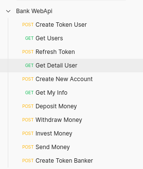

#### Bank WebApi project written in C# using framework .Net Core
#### Token Encryption provided by using JwtToken Bearers.
#### User and Banker accounts was differantiated with authorization
#### For bankers writed user create-delete operations, for users writed money and investment operations.

## Post-Get Requests

## Postman Queries

## Unit Tests
